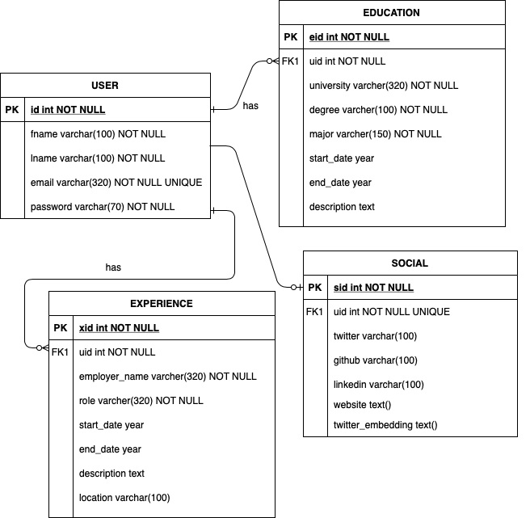
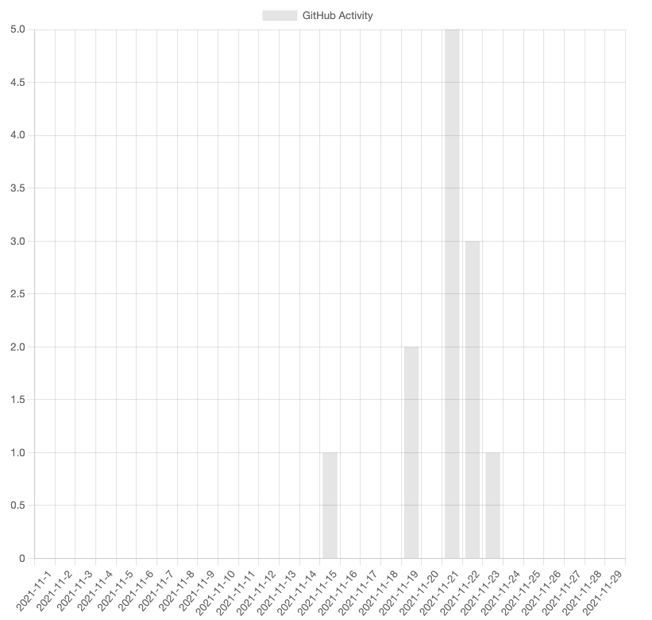

## Details
- **Course**: CS484: Secure Web Development
- **Team**: 27
- **Team Members**: Yashashvi Dave (ydave4@uic.edu)

Link to hosted [Project Proposal](https://uic-cs484.github.io/assignment-1---team-project-proposal-team27/proposal.html)

Link to [Project](https://uic-cs484.github.io/assignment-2---final-project-repository-team27/)

## Project Details

#### Docker
To build the docker image run following command:
`docker build . -t <image_name>:latest`

Once docker image is created, run docker image/nodejs app using following command:
`docker run --publish 3000:3000 <image_name>:latest`

#### Connecting with SQL

The Database file is stored as `database/portfolio.db`. You can import database in DB Browser using this file. You can also create database in any other tools using `database/db.sql` file. 

#### Charting
We have used [chart.js](https://www.chartjs.org/docs/latest/) library for GitHub Activity bar chart at `/user/portfolio` page.
It will render as shown following:

It shows the number of user's activities on GitHub in past month.

#### GitHub API
The GitHub RESTFul API is integrated with the application. You can connect your GitHub account by adding "GitHub username" from "Add Social" option on `/user/add-social` form. The GitHub repositories are rendered on portfolio page of given username at `/user/portfolio`

#### Twitter API Integration
This project integrates the Twitter API. To use Twitter API, 
1. Create the developer account as described [here](https://developer.twitter.com/en/apply-for-access). 
2. Create project and app in https://developer.twitter.com/
3. Get the credentials of your Twitter API
4. Add these credentials in environment. You can add values in `env` file and save it as `.env`
5. Add API token values to `.env` file from the app created in above steps

#### Unit tests
Using Jest.js framework the unit tests are implemented in project. The `test_modules` directory contains all the test files. The `password.test.js` file runs different tests for password validation in file `modules/password_schema.js`
To run the tests: `npm run test`

#### Development tools
- git
- Python3
- Virtual Environment
- SQLite
- Node.js
- passport.js
- Flask or Django
- HTML, CSS, handelbars, Bootstrap
- celery - Automation tasks

#### Workflow strategy
`master` branch is deployed at GitHub Pages. `dev` branch is created for development purposes. 
Project can be divided into following steps:
1. Basic setup with Python framework(backend), JS framework(frontend) and database(SQLite)
2. Integration with different APIs, GitHub, Twitter etc.
3. Authentication and Authorization -- API tokens setup etc. 
4. Dynamic Frontend for data retreived from API
5. Feature to automatically update website content on update from any API
6. Test cases

#### References
https://towardsdatascience.com/create-javascript-gantt-chart-55ff8ec08886

